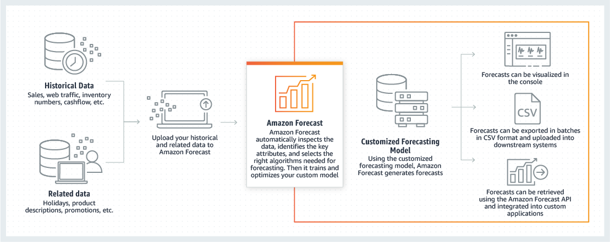


## Amazon Forecast Introduction

[Amazon Forecast](https://aws.amazon.com/forecast/) is a fully-managed AWS service, using the same deep learning probabilistic forecast technology developed at Amazon which offers over 400 million different products and ships billions of packages in 185 different countries every day. 

Amazon Forecast addresses the challenge of more accurate forecasting.  Customers do not need to be machine learning experts in order to achieve accuracy levels that used to take months of engineering.

 - Scale operations by forecasting millions of items, using the same technology as Amazon.com.
   
   
 - Optimize inventory and reduce waste with accurate forecasts at a granular level.  
   
 - Improve capital utilization and make long-term decisions with more confidence.  
 
 - Increase customer satisfaction with optimal staffing to meet varying demand levels.

For more information, [see our documentation](https://docs.aws.amazon.com/forecast/latest/dg/getting-started.html).

Amazon Forecast's strength is its deep learning algorithms. Traditional statistical methods, sometimes called "local models", are able to learn one time series at a time. That means if you have 20K items to forecast, then 20K traditional models are required; each model unable to learn from other models. Traditional statistical algorithms include: Exponential Smoothing (ETS), ARIMA, NPTS, and Prophet. These traditional algorithms are included in Amazon Forecast.

Deep learning algorithms, sometimes called "global models", are able to learn using more than 1 time series at a time. That means if you have 20K items to forecast, and they have interrelationships between them such as item-affinity or cannibalization, such behaviors can be learned by inputting them all into a single model. Amazon Forecast's proprietary deep learning algorithms include: DeepAR+ (an LSTM version of RNN) and CNN-QR (a quantile regression version of CNN, a neural network topology typically used in computer vision).

Using these base models, we have extended their collective effectiveness with a new Amazon Forecast feature, AutoPredictor ([read more](AutoPredictor.md)).

## Is Amazon Forecast a Good Fit?

Not all machine learning problems are forecasting problems. The first question to ask is "*Does my business problem include time series in its statement*?" For example, do you need a particular value only at a particular time and date in the future? Forecasting is not a good fit for general, static (where the particular date/time does not matter) problems, such as fraud detection or recommended movie titles to users.  There are much quicker solutions to static problems.

In addition to having time series data, the data itself should be "dense" and with long histories.

  
[Return to Table of Contents](../README.md)