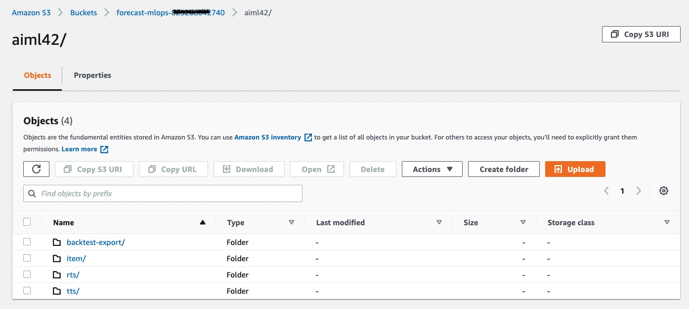

## Creating a trained time-series model

You may repeat this process as a quick start for each use case you intend to deploy.  Since each deployment is mutually exclusive from the other, you can operate each stack independently.

In a prior step at the [Solution Guidance](SolutionGuidance.md) stack creation, the **StackName** parameter was given.

## Visualizing the process of creating a production-ready Amazon Forecast Predictor
```mermaid
graph LR
A[Obtain input data from source system] --> B[Publish data to S3] -->
C[Import Data into Amazon Forecast]---> D[Train Predictor] -- Evaluate Predictor Accuracy and Adjust Inputs --> A
```
 

This page guides how to train an initial predictor with Amazon Forecast.  Looking forward, you may choose to create a new predictor or retrain a predictor during each production cycle which could be daily, weekly, or otherwise. You may also elect **not** to create a predictor each cycle and rely on Predictor Monitoring to guide on when to create one.

**Steps to Create a First, Baseline Predictor**

1. In the AWS Console, navigate to the AWS Step Functions service.  You can do this by typing S3 in the "Step Functions" control in the black menu bar and hitting enter.
2. Once in AWS Step Functions, a list of all state machines is provided.  Type the name of your StackName in the "Search for state machines" control to filter the list, if needed.
3. In the filtered list, one state machine has Create-Predictor.  Click on the link name to open this state machine.
4. Next, simply click Start Execution towards the upper-right of the screen.  
5. Click Start Execution on the secondary screen without changing anything.
6. Allow the state machine to run, the amount of runtime can be dependent on the dataset being processed.  This could take up to an hour or longer to complete.  When it's done, the Execution Status should move from a blue-colored Running to a green-colored Succeeded.
7. While this is running, in your browser, open another tab and use the AWS Console to navigate to Amazon Forecast by typing Forecast in the search control in the black menu bar and hitting enter.
8. In Forecast, navigate to the dataset group with your **StackName** and then find the predictors from the left pane.
9. When the state machine for Create-Predictor is complete, you will evaluate its performance.  
  

  

10. As part of the state machine, the system will create a predictor and also run a BacktestExport job which writes out time-series level predictor metrics to S3.  These are files located in two S3 folders the under backtest-export folder.
  

  
10. Inside backtest-export are two folders:
	 - [ ] **accuracy-metrics-values** provide item-level accuracy metric computations so you can understand the performance of single time-series.  This allows you to investigate the spread rather than focusing on the global metrics alone.
	 - [ ] **forecasted-values** provide step-level predictions for each time-series in the backtest-window(s).  This enables you to compare the actual target value from a holdout test set to the predicted quantile values.  Reviewing this helps formulate ideas on how to provide additional data features in RTS or Item Metadata to help better estimate future values, further reducing loss.  You may download backtest-export files from S3 or query them in place with Amazon Athena.

NEXT: With real data, you need to closely inspect the predictor outcomes and ensure the metrics meet your expected results, by using the Backtest Export data.  When satisfied, you can begin generating future-dated predictions with [Amazon Create Forecast](Forecast.md).